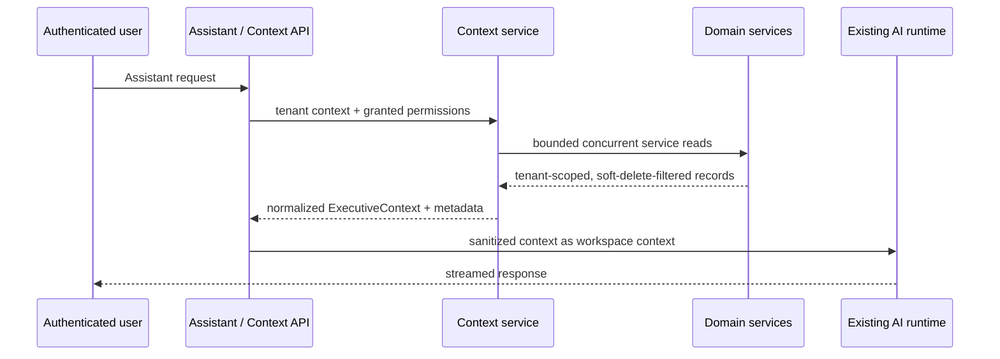

# Executive Context Engine

## Architecture

The Executive Context Engine is the server-side boundary between business data and the AI Executive Assistant. It extends the existing Assistant and autonomous-agent runtime; it does not create an AI runtime, repository, or direct Prisma access path.

Each provider calls an existing domain service while the authenticated request's `TenantContextService` scope is active. Domain repositories retain responsibility for organization filtering and soft-delete handling. The context endpoint is protected by the existing authentication, tenant, and `ai.agent.run` permission guards. Providers additionally omit a source unless the caller has that source's read permission.

## Sources and budgets

CRM reads at most ten opportunities and ten leads. Finance reads twenty transactions and current budgets. Operations reads twenty open activities plus ten failed workflow runs and ten pending approvals. Communications and notifications each read at most ten records. The builder deterministically orders criticality, business amount, recency, and ID, then reports omitted record counts.

Calendar is intentionally reported as excluded until Voltx has an exported, tenant-scoped calendar domain service. Connector credentials and raw calendar integrations are never queried by this layer.

## Caching and performance

The cache key includes organization, user, and a sorted permission fingerprint. Cached data is tagged by tenant, tenant/user, and tenant/source (including the user-scoped source tag) with a short 30-second TTL. `ExecutiveContextInvalidationService` is exposed through a shared injection token, so domain services can invalidate without importing the context implementation and creating circular dependencies.

After successful writes, CRM opportunity/lead changes invalidate `crm`; finance transaction/budget changes invalidate `finance`; task/activity, workflow, and approval changes invalidate `operations`; and notification create/read changes invalidate the affected user's `notifications` context. Workflow terminal success, failure, and cancellation are covered at the engine boundary. Invalidations are best-effort and idempotent: cache failures are logged only with safe tenant/user/source identifiers and never roll back a committed business write. Cache reads and writes also degrade safely, so Redis unavailability does not prevent context assembly.

Provider reads run concurrently and remain bounded, with a target context assembly time below 300 ms on warm local infrastructure.

## Observability

The existing `MetricsService` records context cache hit/miss, invalidation success/failure (by scope), assembly duration, source-fetch duration (by source), trimmed item counts (by source), and excluded-source counts (by source/reason). Metric names use the repository-standard `voltx_` prefix and never include tenant, user, record, prompt, or organization labels. Focused unit tests verify one-time registry creation and emitted metric series.

## Permission and threat model

- Existing authentication, tenant, RBAC, and domain-service business rules remain authoritative.
- No provider uses Prisma or a repository directly.
- The normalized DTO excludes credentials, tokens, passwords, secrets, API keys, raw message bodies, and financial descriptions.
- Labels are control-character-normalized and prompt serialization marks business data as untrusted data, not executable instructions.
- Metadata identifies included sources, exclusions, generation time, tenant/user IDs, and a token estimate. Missing permission and unavailable-source states are explicit; the Assistant cannot fabricate a source.

## Testing strategy

Unit tests cover deterministic ranking, budget trimming, prompt sanitization, tenant/user/source invalidation, and cache failure degradation. The focused `test/ai-context.e2e-spec.ts` suite covers authentication, the `ai.agent.run` guard, normalized metadata, tenant record isolation, and soft-deleted CRM records. Calendar remains explicitly excluded because no exported, tenant-scoped calendar domain service exists. Repository-wide E2E may separately report pre-existing SSO failures; those are not part of this context suite.

## Provider extension guide

Add a provider only in `backend/src/modules/ai/context/context.providers.ts`. It must depend on an exported domain service, declare source read permissions, use bounded service calls, emit only sanitized normalized items, and return an explicit exclusion rather than reaching into a repository. Register it in `context.module.ts` and `context.service.ts`; do not introduce a context repository or direct Prisma query.
