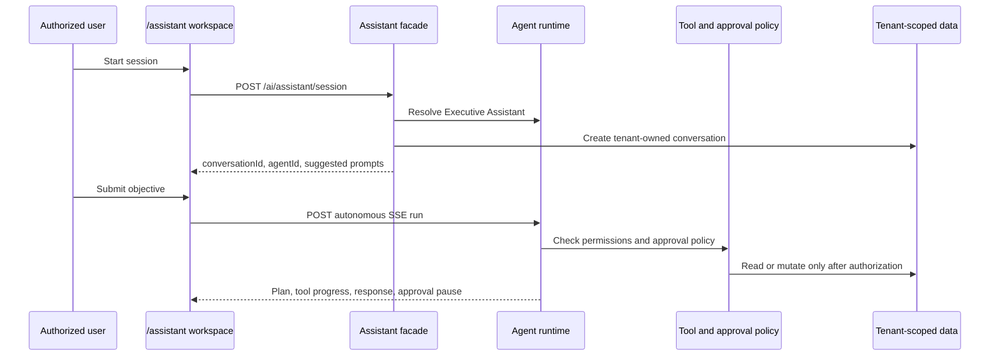

# AI Executive Assistant

## Scope

The Executive Assistant is Voltx's dedicated leadership workspace at
`/assistant`. It is a compositional layer over the existing AI runtime, not a
second chat, provider, tool, approval, or memory implementation.

Starting a session calls `POST /api/v1/ai/assistant/session`. The endpoint
resolves the tenant's existing `Executive Assistant` system agent and creates
a normal tenant-owned AI conversation. The browser then uses the established
authenticated SSE endpoint to run that agent autonomously against the session.

## Request Flow

## Security And Auditability

- Session creation and execution require the existing `ai.agent.run`
  permission. The Assistant page does not receive or decide permission sets.
- Conversation creation uses `ConversationService`, which derives the active
  organization and user from `TenantContextService`.
- Execution is delegated to `AgentService.runAutonomousAgentStream`. Existing
  tool-level RBAC, allowlists, approval persistence/resume, model usage
  accounting, streamed lifecycle events, and audit records remain the source
  of truth.
- The frontend renders only events emitted by the server. It does not present
  simulated tool outcomes, citations, approval states, or business facts.
- A stopped stream cancels the browser request; run state and any completed
  server-side audit records remain observable through existing AI operations
  surfaces.

## API Contract

| Route | Permission | Purpose |
| --- | --- | --- |
| `POST /ai/assistant/session` | `ai.agent.run` | Resolve the system Executive Assistant and create a tenant-local conversation. |
| `POST /ai/agents/:id/run/autonomous/stream` | `ai.agent.run` | Existing SSE execution contract used by the workspace. |

The session response includes `conversationId`, `agentId`, and server-defined
suggested prompts. The API returns `503` when no configured provider can
provision the system agent; it does not create a partial conversation.

## Operations

No migration or new provider configuration is required. Deploy the backend and
web applications together so `/assistant` calls the matching session endpoint.
Monitor existing agent-run metrics, audit logs, approval queues, and provider
usage dashboards for runtime health. An approval that pauses an Assistant run
must be decided through the existing AI approval workflow; execution resumes
only through its persisted, audited decision path.

## Validation

- `backend/test/assistant.service.spec.ts` verifies Executive Assistant
  resolution, normal conversation creation, and unavailable-provider handling.
- Backend strict TypeScript validation verifies the Nest module and guarded API
  contract.
- Web strict TypeScript validation verifies the typed session client and SSE
  workspace.