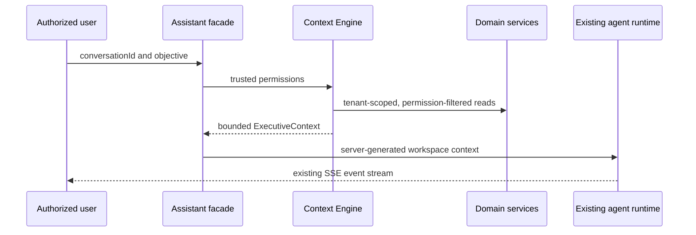

# Executive Context Engine

The Executive Context Engine builds bounded, tenant-local business context for the Executive Assistant. It is a composition layer, not an AI runtime or data-access layer: every provider calls an existing domain service and never accesses Prisma or repositories directly.

## Security and permissions

`GET /api/v1/ai/context` and `POST /api/v1/ai/assistant/run/stream` require the established JWT, user-context, tenant, and permission guards, including `ai.agent.run`. Providers additionally require their domain read permissions. Missing permissions and unavailable sources are returned as explicit metadata exclusions. The client never supplies business context to the Assistant stream endpoint.

Only allowlisted labels, statuses, dates, numeric amounts, and simple details are included. Free-text notes, descriptions, message bodies, metadata, credentials, and attachments are excluded. Prompt serialization labels this input as untrusted data rather than instructions, normalizes control characters, and caps labels at 160 characters.

## Performance and caching

Providers execute concurrently. Context is cached for 30 seconds per organization, user, and permission set, using tenant/user tags for invalidation. The design target is under 300 ms for a warm cache and bounded domain reads for cache misses. The service exposes tenant-tag invalidation for domain mutation hooks.

## Testing and extension

The builder test verifies deterministic priority, stable ties, item caps, omission summaries, normalization, and serialization posture. Provider additions must use an exported domain service, declare required permissions, return only allowlisted fields, add a deterministic mapping test, and report unavailable data through `excludedSources` rather than inventing a value.